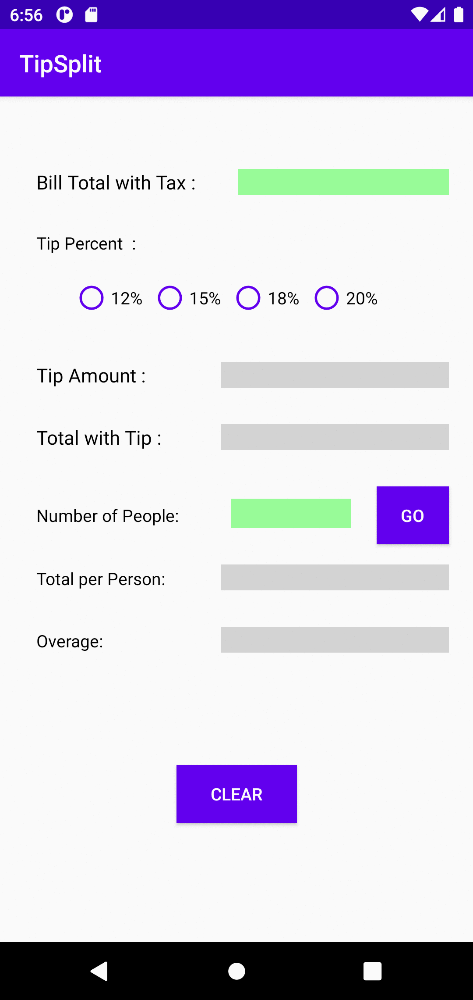

  
  

  <b>Tip/Split Calculator</b>

   
  
   

## What is Tip Calculator and why do I care?

Tip Calculator is a mobile app and it is developed for the Android Operating System.

The app will assist you in calculating your total dining with tip added and will allow you to split that total evenly for each person dining ,specifying the amount owned by each person . User is asked to enter original bill total ,desired tip percentage and the number of people to split the total with tip . 

After entering the bill total with tax, selecting a tip percentage radio button will result in the 
tip amount and total with tip values is calculated and their data fields on the UI is filled in 

After entering the Number of people value and by tapping the “GO” button, the total per person and 
remainder/overage values is calculated and their data fields on the UI is filled in 

Next Pressing the “Clear” button will clear all fields – the Bill Total with Tax, Tip Amount, Total with Tip, 
Number of People, Total per Person, Overage, and any selected radio button is unselected .

So here comes the “Tip Calculator” 🎉.

* Calculates Tip Fastly
* Works in both Potrait and Landscape 
* Material Design.
* Blazingly fast and lightweight.
* No Ads, No Pop-ups.

  

## Platform limitations :

* This is an Android Application, Apologies iOS users (and Windows users).
* This app works great with Android Oreo (API 26) and above.
* This is an offline application and it doesn't require internet

## Disclaimer and Privacy statement:

To be 100% transparent:

* Tip Calculator does not and will never collect user information in terms of user privacy.
* I will not track your IP. 
* No personal data or files will be sent to me or third parties. 

I might use analytics tools to collect basic usage data such as how many times the program has been downloaded.

Feel free to review the source code.

## Contributing:

* Tip Calculator is free and open source, if you like my work, please consider:
   * Star this project on GitHub
   * Endorse me [here](https://www.linkedin.com/in/nithin-reddy-rupireddy/)

## Stay tuned 📢
